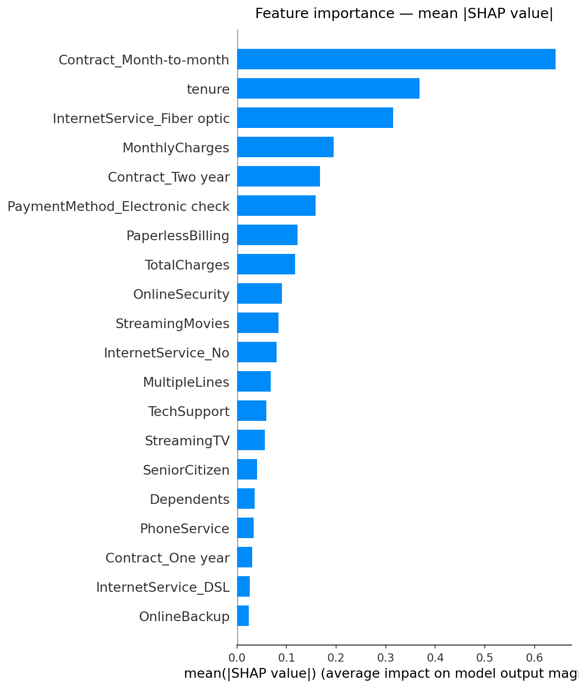
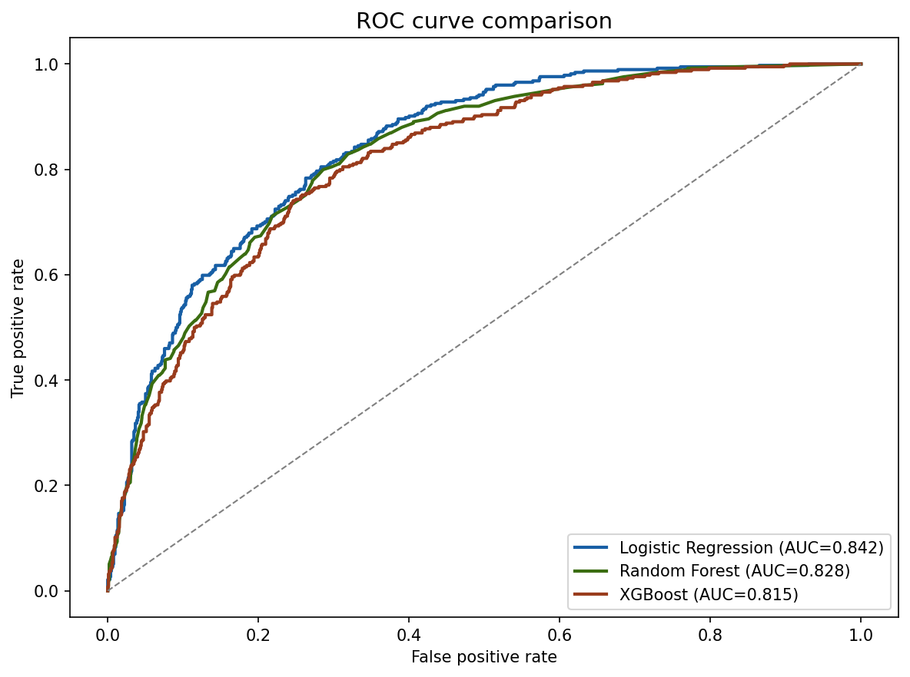
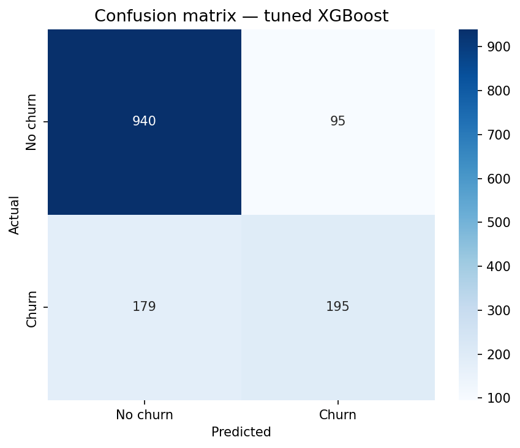

# Customer Churn Prediction with SHAP Explainability

> Predicting which telecom customers will churn using XGBoost,
> with SHAP-based explainability for business decision support.

---

## Problem statement
Telecom companies lose significant revenue to customer churn.
This project builds an ML pipeline to predict churn probability
per customer — enabling proactive, targeted retention campaigns.

**Dataset**: IBM Telco Customer Churn (~7,000 customers, 20 features)

---

## Results

| Model               | Test AUC | Test F1 |
|---------------------|----------|---------|
| Logistic Regression | 0.8424   | 0.6012  |
| Random Forest       | 0.8279   | 0.5579  |
| XGBoost (tuned)     | 0.8485   | 0.5873  |

> **Why AUC-ROC over accuracy?** The dataset is imbalanced (~26% churn).
> A naive model predicting "no churn" always achieves 74% accuracy —
> AUC-ROC and F1 give a more honest picture.

---

## Visual highlights

### SHAP feature importance


### ROC curves


### Confusion matrix


---

## Key findings
- Contract type is the strongest churn predictor — month-to-month
  customers churn at 3x the rate of 2-year contract customers
- Short tenure (under 12 months) strongly predicts churn
- High monthly charges amplify churn risk for new customers

---

## Project structure
churn-prediction/
├── data/
├── notebooks/
│   ├── 01_EDA.ipynb
│   ├── 02_Preprocessing.ipynb
│   ├── 03_Modeling.ipynb
│   └── 04_Explainability.ipynb
├── src/
│   └── preprocessing.py
├── requirements.txt
└── README.md

---

## How to run
```bash
git clone https://github.com/rayan-baderdine/churn-prediction
cd churn-prediction
pip install -r requirements.txt
jupyter notebook
```

---

## Tech stack
Python · pandas · scikit-learn · XGBoost · SHAP · Optuna · Matplotlib

---

*By Rayan Baderdine — www.linkedin.com/in/rayan-baderdine-5b32992a2 · https://github.com/rayan-baderdine*